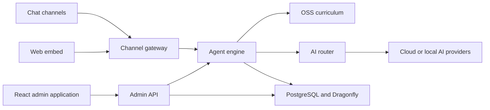

<div align="center">

# P&AI Bot

Curriculum-grounded AI tutoring through chat.

Open source · self-hostable · cloud or local AI · built for schools

[How it works](#how-pai-works) · [Available now](#what-is-available) · [Run locally](#run-pai-locally) · [Develop](#develop-pai) · [Deploy](#deploy-pai)

[](LICENSE)
[](https://goreportcard.com/report/github.com/p-n-ai/pai-bot)
[](go.mod)

</div>

## Learning support between lessons

P&AI helps students learn and practise in the chat tools they already use.
It connects each conversation to curriculum, learning progress, quizzes, goals, and scheduled review.

P&AI keeps this context between conversations.
The tutor can continue from the learner's current topic instead of starting a new generic chat.

| Role | What P&AI provides |
| --- | --- |
| Students | Guided explanations, practice, progress, goals, and review reminders |
| Teachers | Class progress, student details, conversation history, and targeted nudges |
| School administrators | Access controls, AI settings, usage data, metrics, and exports |

The project currently targets Malaysian secondary education.
It loads KSSM curriculum data from [Open School Syllabus](https://github.com/p-n-ai/oss).

## How P&AI works

1. A student sends a message through a connected chat channel or the web embed.
2. P&AI loads the learner profile, recent conversation, goals, progress, and review schedule.
3. The agent adds relevant topics, teaching notes, and assessments from the curriculum.
4. A configured AI provider creates the response from this teaching context.
5. P&AI returns the reply through the same channel and saves the updated learning state.

The same agent engine runs quizzes, goals, challenges, and scheduled review nudges.

## What is available

| Area | What works now |
| --- | --- |
| Tutoring | Curriculum-grounded chat, learner onboarding, teaching plans, and conversation history |
| Practice | OSS-backed quizzes, hints, answer checks, and feedback |
| Progress | Per-topic mastery, due reviews, goals, streaks, XP, and leaderboards |
| Engagement | Proactive nudges and peer challenges |
| Chat channels | Telegram, Slack, Discord, and Microsoft Teams |
| Web access | Authenticated web embed, plus a development WebSocket chat route |
| Admin web app | Class mastery, student details, parent summaries, invites, exports, metrics, and AI usage |
| AI providers | OpenAI, Anthropic, DeepSeek, Google Gemini, OpenRouter, Ollama, and Codex |
| Self-hosting | Local Docker Compose, production Compose, and Helm |

P&AI is under active development. Configure and test each external channel before production use.

External AI providers receive the input needed to create a response.
Use Ollama when this input must stay on your infrastructure.

## Run P&AI locally

The shortest path uses [ONCE](https://github.com/basecamp/once) to run the complete application in one development image.

### Before you start

- Git
- Docker with a running daemon
- Docker Compose v2
- macOS or Linux on `amd64` or `arm64`

### Start a local demo

```bash
git clone --recurse-submodules https://github.com/p-n-ai/pai-bot.git
cd pai-bot
cp .env.example .env
./scripts/once-dev.sh
```

The script installs a checksum-verified ONCE binary when needed.
It then builds the application, applies database migrations, and adds demo data.

Open these local endpoints:

| Endpoint | Purpose |
| --- | --- |
| `http://localhost` | Admin web application |
| `http://localhost/docs` | Interactive API reference |
| `http://localhost/openapi.json` | OpenAPI document |

The application can start without an AI provider, but tutoring needs one.
Choose a provider in `.env` before you test a conversation.

For example, configure OpenRouter:

```env
LEARN_AI_DEFAULT_PROVIDER=openrouter
LEARN_AI_OPENROUTER_API_KEY=your-api-key
LEARN_AI_OPENROUTER_MODEL=provider/model
```

You can instead configure OpenAI, Anthropic, DeepSeek, Google Gemini, or Ollama.
The production image also supports Codex through the admin AI settings.

Read the [environment variable reference](.env.example) for every provider and channel option.

Stop or remove the local application with:

```bash
./scripts/once-dev.sh stop
./scripts/once-dev.sh remove
```

## System design

P&AI runs as one Go backend with separate internal domains.
This keeps deployment simple while separating chat, tutoring, progress, authentication, and admin API code.



### Main components

| Component | Implementation | Responsibility |
| --- | --- | --- |
| Backend | Go 1.25 | Server lifecycle, chat adapters, agent logic, and APIs |
| Admin | React, Vite, and TanStack Router | Teacher, parent, and administrator workflows |
| Database | PostgreSQL with pgvector and pgGraph | Product data, retrieval data, and learning state |
| Cache | Dragonfly | Redis-compatible cache and coordination |
| Curriculum | YAML from OSS | Topics, teaching notes, prerequisites, and assessments |
| Edge | Caddy | Local and production HTTP routing |

### Repository map

| Path | Contents |
| --- | --- |
| [`cmd/`](cmd/) | Executable entrypoints |
| [`internal/`](internal/) | Backend domains and platform code |
| [`admin-spa/`](admin-spa/) | Admin web application |
| [`site/`](site/) | Astro documentation site |
| [`migrations/`](migrations/) | PostgreSQL migrations |
| [`skills/`](skills/) | Optional `SKILL.md` teaching abilities |
| [`deploy/`](deploy/) | Docker, Caddy, ONCE, and Helm assets |

## Connect channels and AI

Development mode does not require an external chat channel.
Production requires one complete channel configuration and one AI provider.

| Channel | Configuration start |
| --- | --- |
| Telegram | `LEARN_TELEGRAM_BOT_TOKEN` |
| Slack | `LEARN_SLACK_ENABLED` |
| Discord | `LEARN_DISCORD_ENABLED` |
| Microsoft Teams | `LEARN_TEAMS_ENABLED` |
| Web embed | `LEARN_EMBED_BASE_URL` |

Set `LEARN_AI_DEFAULT_PROVIDER` to `openai`, `anthropic`, `deepseek`, `google`, `openrouter`, `ollama`, or `codex`.

Platform administrators can change supported AI settings at runtime.
Environment values remain the deployment baseline.
Read the [runtime AI settings guide](docs/operations/runtime-ai-settings.md) for precedence and secret rotation rules.

## Develop P&AI

### Requirements

- Go 1.25
- Node.js and pnpm for the web applications
- Docker and Docker Compose v2
- [`just`](https://github.com/casey/just)

Prepare `.env`, dependencies, local PostgreSQL, Dragonfly, migrations, and demo data:

```bash
cp .env.example .env
just prepare-local-dev
```

Run the backend and admin application:

```bash
just go
just admin-spa
```

`just admin-spa` starts Vite and tries to start the backend when needed.

Use the terminal client to test the same agent engine without an external chat adapter:

```bash
just chat-terminal
```

### Checks

```bash
just test                 # Go unit tests
just test-integration     # Go integration tests
just admin-spa-check      # Types, lint, format, tests, and build
just admin-spa-e2e        # Browser tests
just test-all             # Go lint and tests, plus the admin check
```

`just test-all` does not include integration or browser tests.

## Deploy P&AI

Use [`docker-compose.prod.yml`](docker-compose.prod.yml) for a single-server deployment.
Use the [`deploy/helm/pai`](deploy/helm/pai/) chart for Kubernetes.

Generate separate auth and configuration-encryption secrets before production:

```bash
go run ./cmd/init-secrets -out /private/path/pai-bot-secrets.env
go run ./cmd/validate-production-secrets
```

Do not commit the generated secret file.

Read these guides before deployment:

- [Release and rollback process](docs/releases.md)
- [Runtime AI settings and secret rotation](docs/operations/runtime-ai-settings.md)
- [Conversation identity migration](docs/operations/conversation-identity-migration.md)

A merge to `main` creates a release candidate after CI passes. It does not deploy production.
A feature is shipped only when it is included in a release tag.

## Related projects

| Project | Purpose |
| --- | --- |
| [Open School Syllabus](https://github.com/p-n-ai/oss) | Open curriculum data used by the agent |
| [oss-bot](https://github.com/p-n-ai/oss-bot) | Tools for curriculum contributions and review |

## Contribute

Use [GitHub Issues](https://github.com/p-n-ai/pai-bot/issues) to report a defect or propose a change.

Run the relevant checks before you open a pull request.
Curriculum contributions belong in the [OSS repository](https://github.com/p-n-ai/oss).

## License

P&AI Bot uses the [Apache License 2.0](LICENSE).
