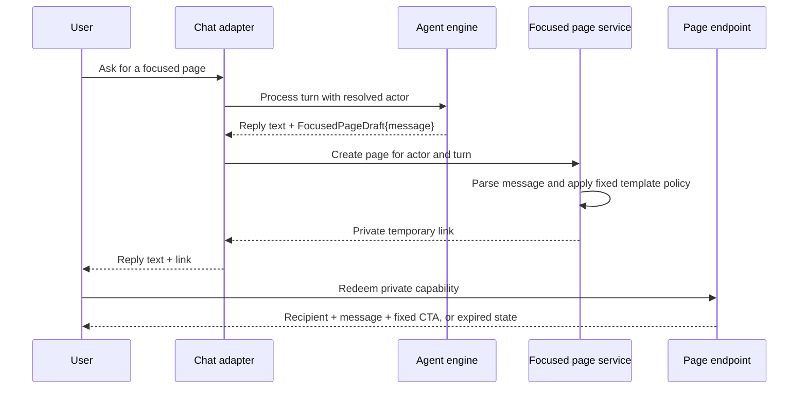

# P&AI Focused Conversation Page Design Doc

## Problem Context

P&AI conversations currently end in text. Occasionally the learner needs one message to feel more deliberate and easier to revisit than another chat bubble.

The previous proposal gave the model a page-document schema with several block types. That makes the model choose content, structure, and presentation at once. It increases generation failure modes before we have proved the basic product value.

The first slice needs one private temporary page containing one personalized message. Everything else should be deterministic application policy.

## Proposed Solution

Add focused conversation pages:

- The model produces one `message` string through structured output.
- The server injects the trusted learner name and conversation identity.
- One fixed page template renders recipient, message, expiry, and a fixed “Continue with P&AI” action.
- The server creates a private capability link and sends it with the same chat turn.
- The page expires or can be revoked; it never becomes a permanent dashboard.

Compared with the current text response, the user receives a focused page they can open and revisit briefly. Compared with the prior block-document proposal, the model has one decision: what message to say.

## Goals and Non-Goals

### Goals

- Same-turn delivery: reply text and one private focused-page link arrive together.
- Low model burden: model outputs only a message.
- Personalization: server injects the resolved learner identity.
- Temporary privacy: every page has enforced expiry and revocation.
- Retry safety: a retried turn reuses the same page.

### Non-Goals

- Model-selected layouts, blocks, titles, CTA labels, themes, lifetimes, or URLs.
- Arbitrary HTML, Markdown, scripts, media, or embedded external content.
- Permanent page history or artifact library.
- Page-side mutation of goals, progress, or account state.
- Cross-channel account linking.

## Design

The focused page is an immutable message snapshot owned by one learner and conversation. The application owns every presentation and lifecycle decision.



### Key Components

#### Focused Page Draft

```go
type TurnResult struct {
    Text string
    Page *FocusedPageDraft
}

type FocusedPageDraft struct {
    Message string `json:"message"`
}
```

The structured-output schema contains one required string. The boundary parser trims it, rejects empty or oversized content, and returns a refined message value.

For the first slice, only an explicit user request creates a page. Normal tutoring turns remain text-only.

#### Fixed Page Template

The application supplies:

- P&AI branding.
- “A message for {learner name}” heading.
- Parsed model message rendered as plain text.
- Expiry status.
- Fixed “Continue with P&AI” action.
- Expired-page copy that reveals no previous message.

The model cannot alter these fields. The renderer never interprets HTML or Markdown.

#### Page Creation

`FocusedPageService.Create` receives the resolved actor, conversation ID, turn ID, parsed message, and server-selected lifetime.

Creation sequence:

1. Parse the message.
2. Resolve the learner display name from trusted application data.
3. Generate a public ID and high-entropy capability secret.
4. Store only the capability hash.
5. Persist the immutable message and expiry.
6. Return the private link.

Use `(tenant_id, turn_id, page_index)` as the idempotency key. The first version allows at most one page per turn, so `page_index` is always zero but keeps the persisted contract explicit.

#### Page Instance Data

| Field | Purpose |
|---|---|
| `id`, `public_id` | Internal identity and non-secret route identity |
| `tenant_id`, `owner_user_id` | Enforced ownership scope |
| `conversation_id`, `turn_id` | Provenance and idempotency |
| `recipient_name`, `message` | Immutable page snapshot |
| `token_hash` | Verify capability without storing raw secret |
| `status` | `active`, `revoked`, or `expired` |
| `expires_at`, lifecycle timestamps | Access enforcement and diagnosis |

Tenant and owner must be enforced together in the database and every repository query.

#### Private Link and Expiry

Send `/a/{public_id}#secret`:

- Initial request contains no secret.
- Page JavaScript posts the fragment secret to the same-origin redeem endpoint.
- Server hashes the secret and compares it to `token_hash`.
- Browser removes the fragment after redemption.
- Responses use `Cache-Control: private, no-store`, restrictive CSP, and `Referrer-Policy: no-referrer`.
- Logs never contain capability, message, or full URL.

The endpoint rejects expired or revoked pages before returning recipient or message data. Cleanup later deletes expired rows; cleanup delay never extends access.

#### Conversation Delivery and Failure

The server creates the page before channel send and appends the private link to `chat.OutboundMessage`.

If message generation or page creation fails, send the useful text response without a link. If channel delivery fails, retain the idempotent page for retry until normal expiry.

The page CTA is application-owned and only returns to a trusted P&AI conversation. It does not mutate learner state.

## Alternatives Considered

| Alternative | Pros | Cons | Why Not Chosen |
|-------------|------|------|----------------|
| Fixed focused-message page | Small model contract, predictable UI, easy validation | One presentation shape | Chosen for first proof |
| Bounded block document | Supports plans, lists, metrics, and reports | Model must choose structure; larger renderer and schema | Defer until one-message page proves insufficient |
| Preset-specific templates | Strong control per use case | New code for each conversational result | More surface than the first slice needs |
| Model-generated HTML | Maximum flexibility | Unsafe and inconsistent | Invalid trust boundary |
| Text-only chat | No new infrastructure | Message remains buried in conversation | Does not provide the focused surface requested |

## Open Questions

- [ ] What explicit user wording triggers page creation?
- [ ] What server-owned lifetime should the first page use?
- [ ] May the page be opened repeatedly until expiry?
- [ ] Which channel proves the first end-to-end slice?
- [ ] What message size limit preserves a focused page?

## Implementation Plan

### Phase 1: Foundation

- Add resolved `Actor`, `TurnResult`, `FocusedPageDraft`, and refined message type.
- Add focused-page persistence, tenant/owner constraints, idempotency, lifecycle states, and repository.
- Add capability generation, hash verification, redemption, expiry, and revocation.
- Build the single fixed renderer.

### Phase 2: Core Implementation

- Add one explicit conversation path using `ai.CompleteJSON` with `{message}` only.
- Create the page idempotently inside the inbound turn.
- Send reply text plus the private link through one selected channel.
- Serve active, expired, and revoked page states.
- Fall back to text when page generation or creation fails.

### Phase 3: Polish & Testing

- Unit-test message parsing, capability hashing, lifecycle transitions, and idempotency.
- Integration-test wrong-token, expired, revoked, cross-user, cross-tenant, oversized-message, and retry behavior.
- Contract-test channel delivery of reply text plus private link.
- Browser-test keyboard operation, narrow and wide layouts, fragment removal, expiry, reduced motion, and console state.
- Add cleanup, no-store caching, CSP, referrer isolation, token-safe logging, and operational documentation.
- Run one test-account smoke from explicit chat request through page expiry.

## Appendix

Relevant current seams:

- `internal/agent/engine.go`: string-only `ProcessMessage` boundary.
- `internal/ai/router.go`: existing `CompleteJSON` path.
- `internal/chat/gateway.go`: channel-neutral outbound message.
- `cmd/server/main.go`: inbound turn and outbound send orchestration.

---

Open questions to discuss:

1. What explicit user request should create the first focused page?
2. What lifetime should the server apply?
3. Which channel should prove delivery first?

Ready to refine any section or proceed to implementation?
