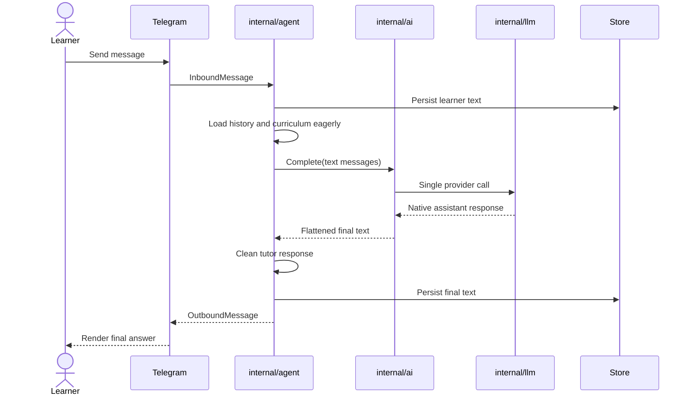
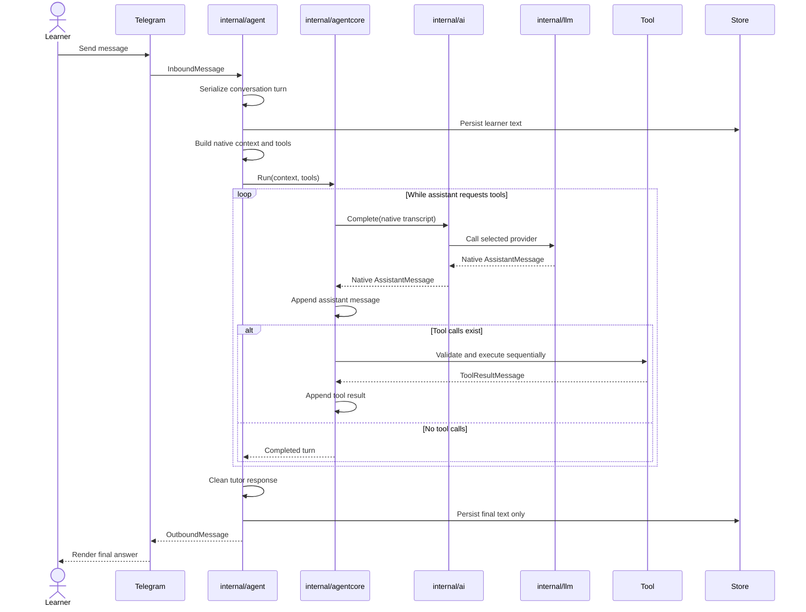

# P&AI Agent Core Design Doc

## Problem Context

The tutor currently performs one text-only completion per teaching turn. `internal/agent/teaching_turn.go` builds tutor context, calls `ai.Router.Complete` once, post-processes text, persists it, and delivers it. The model cannot request a tool and continue the same turn.

`internal/llm` already represents native `ToolCall`, `ToolResultMessage`, `Tool`, and `Context` values. The missing layer is a small continuation loop between tutor policy and model transport. The current `internal/ai` adapter flattens native model output back to text, so it discards the structure that loop needs.

Pi proves the useful core is small: call the model, append its assistant message, execute requested tools, append paired results, and call the model again. Pi also includes parallel tools, steering, event streams, extensions, and other features P&AI does not need in the first version.

## Proposed Solution

Add a provider-neutral `internal/agentcore` package with one job:

- Accept a native model context and registered tools.
- Call a model through a narrow interface owned by `internal/ai`.
- Append every native assistant response.
- Execute tool calls sequentially and append paired tool results.
- Continue until the assistant returns no tool calls, the context is cancelled, or a hard turn limit is reached.

`internal/agent` remains the tutor. It owns teaching policy, curriculum selection, persistence, progress, cleanup, and channel delivery. The core has no learner-move classifier, planner, ratings, database, Telegram logic, or provider credentials.

## Goals and Non-Goals

### Goals

- Goal 1: Give the tutor a real model → tool → model continuation loop while preserving native messages.
- Goal 2: Keep the loop exemplary simple: one transcript, sequential tools, one termination rule.
- Goal 3: Make cancellation, tool errors, and turn limits explicit and testable.
- Goal 4: Keep the conversation harness deterministic, database-free, and outside the production runtime path.

### Non-Goals

- Learner-move or tutor-move routing; tutoring quality stays in tutor context and tools.
- Parallel tool execution, steering, branching, extensions, or Pi-compatible APIs.
- Persistence, curriculum policy, progress, ratings, or channel formatting inside the core.
- Replacing `internal/ai` routing, fallback, credentials, budgets, or provider selection.
- Streaming intermediate events to product clients in the first version.

## Design

The core operates only on native messages. `internal/agent` builds the initial context and tools. `internal/ai` supplies a native-message model implementation while retaining model routing and fallback. `internal/chat` renders the final answer for Telegram or another channel after the core returns.

#### Current sequence: before



#### Proposed sequence: after



### Key Components

#### Core loop

The loop mirrors the load-bearing part of Pi's `packages/agent/src/agent-loop.ts`, without its extension surface or parallel execution.

```go
for {
    reply, err := model.Complete(ctx, transcript.Context())
    if err != nil {
        return Result{}, err
    }

    transcript.Append(reply)
    calls := reply.ToolCalls()
    if len(calls) == 0 {
        return Result{Final: reply, Messages: transcript.Messages()}, nil
    }

    for _, call := range calls {
        result, err := tools.Execute(ctx, call)
        if err != nil {
            result = toolErrorResult(call)
        }
        transcript.Append(result)
    }
}
```

The implementation also checks cancellation and a fixed maximum model-call count. Tool lookup, argument validation, thrown errors, and cancellation return `llm.ToolResultMessage{IsError: true}` when the model can still recover. A broken core invariant returns a Go error.

#### Native model port

`internal/agentcore` depends on an interface, not the global provider registry:

```go
type Model interface {
    Complete(context.Context, llm.Context, *llm.StreamOptions) (llm.AssistantMessage, error)
}
```

`internal/ai` implements this port so existing fallback, retries, circuit breakers, model choice, credentials, budgets, and tracing remain in one place. The existing text-only `ai.Provider` path can remain for callers not yet migrated.

The core boundary uses one system-instruction representation: populate `llm.Context.SystemPrompt` and reject system messages in `Context.Messages`. This prevents duplicate system instructions.

#### Tool contract

A tool has inert metadata plus one cancellable action:

```go
type Tool interface {
    Definition() llm.Tool
    Execute(context.Context, llm.ToolCall) (llm.ToolResultMessage, error)
}
```

Calls execute sequentially. Every result preserves `ToolCallID` and `ToolName`. Unknown tools, invalid arguments, and execution errors become payload-safe error results, allowing the model to correct the request on the next pass.

The first proving tool is an illustrative curriculum lookup. Today curriculum context is resolved eagerly in `internal/agent/teaching_turn.go`; moving that lookup behind a model tool is a separate tutor-policy change, not part of creating the core.

#### Tutor and Telegram ownership

`internal/agent` builds the teaching prompt, loads history, decides which tools exist, persists the completed turn, post-processes tutor prose, and updates mastery. It calls the core once per teaching turn.

The native tool transcript is in-memory execution state in v1. Current stored conversations support textual `user`, `assistant`, and `system` rows, so the tutor persists the learner message and final assistant answer only. Structured execution logs may record tool names, call IDs, timing, and outcomes without storing tool payloads or creating a second conversation history.

Telegram remains a delivery adapter. `cmd/server/main.go` normalizes Telegram Markdown and keyboards; `internal/chat/telegram.go` splits messages at the Bot API limit and retries plain text when Markdown parsing fails. The core returns semantic assistant content and never formats Telegram output.

Telegram currently dispatches inbound updates concurrently. A multi-model-call turn widens the chance that two messages for one conversation overlap. The teaching layer must serialize active turns per conversation before enabling the new loop; ordering does not belong in the generic core.

Ratings are removed from the teaching path separately. That cleanup includes rating packet injection, callback state, keyboard inference, events, and tests; it is not an agent-core responsibility.

#### Hard-simple conversation harness

The harness is test code around the public core interface:

1. Provide an in-memory transcript.
2. Provide a scripted fake model with two responses: tool call, then final answer.
3. Provide one in-memory fake tool.
4. Run the real core loop.
5. Assert the exact native transcript and termination reason.

No production database, network, Telegram bot, prompt evaluator, classifier, golden-score framework, or deployment gate. A small table test covers direct answer, one tool round trip, tool error recovery, cancellation, and model-call limit. Optional production conversation samples must be sanitized fixtures checked into testdata before use.

#### Diagnostics

V1 uses structured server logs, not a public intermediate-event stream. Logs record run ID, conversation ID, model call count, tool name, tool call ID, duration, error status, and termination reason. They never record tool arguments, tool results, prompts, credentials, or learner text by default.

## Alternatives Considered

| Alternative | Pros | Cons | Why Not Chosen |
|-------------|------|------|----------------|
| Keep single-shot `ai.Router.Complete` | No new package | Cannot preserve or continue tool calls | Does not create an agent core |
| Put loop in `internal/agent` | Fewer packages initially | Mixes generic continuation with tutor policy and persistence | Makes reuse and deterministic testing harder |
| Call `internal/llm` directly from core | Smallest call path | Bypasses AI routing, fallback, budgets, and tracing | Breaks existing ownership |
| Port Pi agent core wholesale | Mature features | Imports parallel tools, steering, events, and extension complexity | Far beyond P&AI's first concrete use |
| Add learner/tutor move routing | Explicit behavior labels | Adds a classifier and second control system | Conversation quality should emerge from context, tools, and the loop |

## Open Questions

- None. V1 scope and ownership decisions are fixed in this document.

## Implementation Plan

### Phase 1: Foundation

- Add `internal/agentcore` transcript, model port, tool registry, result, and termination types.
- Add deterministic tests for direct answer, one tool call, unknown tool, invalid arguments, cancellation, and maximum model calls.
- Add a native-message adapter in `internal/ai` that preserves current routing and fallback behavior.
- Add conversation-scoped turn serialization in the teaching layer.

### Phase 2: Core Implementation

- Implement the sequential continuation loop and native tool-result pairing.
- Integrate one teaching-turn path behind a runtime flag; keep current single-shot path available for rollback.
- Register one curriculum lookup tool without moving tutor policy into the core.
- Remove rating injection and Telegram rating callbacks from the tutor path as a separate, reviewable change.

### Phase 3: Polish & Testing

- Run focused `internal/agentcore`, `internal/ai`, `internal/agent`, and Telegram channel tests.
- Add an integration test proving user input → tool call → tool result → final Telegram-ready answer.
- Verify cancellation, tool timeout, repeated tool failure, model-call limit, and direct-answer behavior.
- Document the package contract and update runtime architecture docs after the flag is enabled.

## Appendix

- Pi reference: `/Users/thor/work/pi/packages/agent/src/agent-loop.ts` at local commit `dc7b547f6284`.
- Current tutor turn: `internal/agent/teaching_turn.go`.
- Native message types: `internal/llm/types.go`.
- Model transport registry: `internal/llm/registry.go`.
- Current native-to-text adapter: `internal/ai/provider_openrouter_llm_adapter.go`.
- Telegram runtime: `docs/runtime/telegram.md` and `internal/chat/telegram.go`.
- Interactive execution view: `docs/agent-core-design.html`.
- Before/after sequence view: `docs/agent-core-sequence.html`.

---

Open questions to discuss:
1. None. V1 scope is finalized.

Ready to proceed to implementation.
