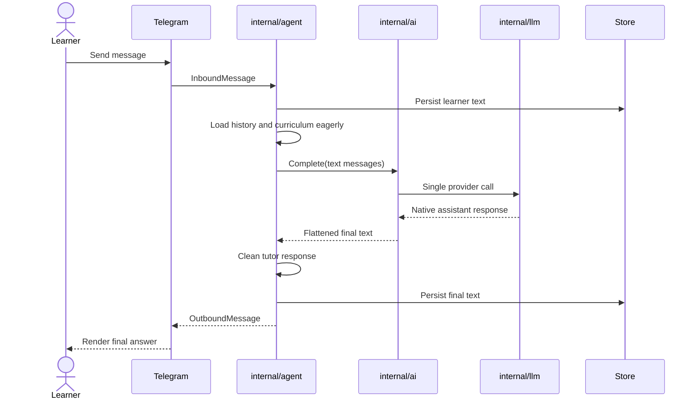
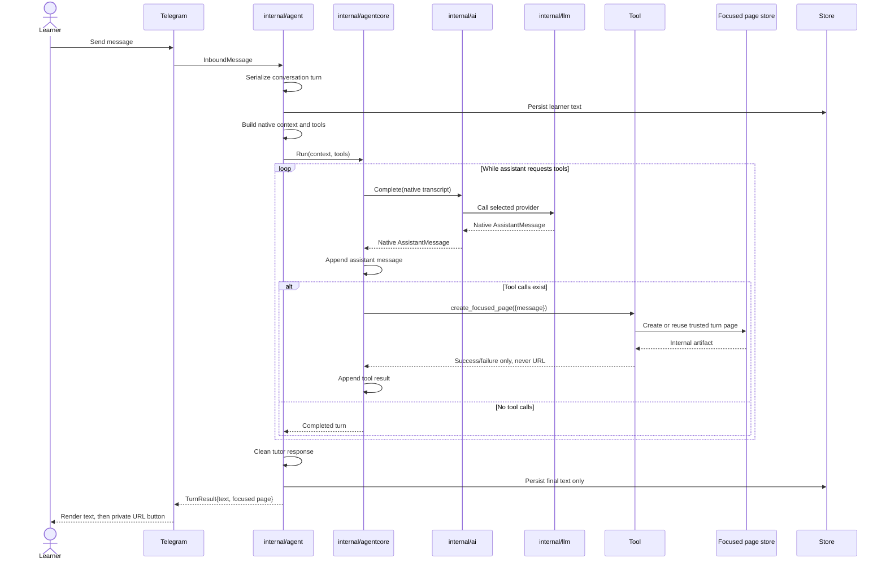

# P&AI Agent Core Design Doc

## Problem Context

The default tutor path performs one text-only completion per teaching turn. The configured Telegram focused-page path now uses a native model → tool → model continuation loop, while other channels and installations without focused-page configuration keep the established text-only path.

`internal/llm` represents native `ToolCall`, `ToolResultMessage`, `Tool`, and `Context` values. `internal/agentcore` now preserves those values through a small sequential continuation loop, and `internal/ai.Router.CompleteNative` retains provider routing, fallback, retry, and circuit-breaker ownership. The OpenRouter adapter is the first native-capable provider; text-only providers are skipped for native requests.

## Solution

The implemented provider-neutral `internal/agentcore` package has one job:

- Accept a native model context and registered tools.
- Call a model through a narrow interface owned by `internal/ai`.
- Append every native assistant response.
- Execute tool calls sequentially and append paired tool results.
- Continue until the assistant returns no tool calls, the context is cancelled, or a hard turn limit is reached.

`internal/agent` remains the tutor. It owns teaching policy, curriculum selection, persistence, progress, cleanup, and channel delivery. The core has no learner-move classifier, planner, ratings, database, Telegram logic, or provider credentials.

## Goals and Non-Goals

### Goals

- Preserve native messages through a real model → tool → model continuation loop.
- Keep one transcript, sequential tool execution, and one termination rule.
- Make cancellation, tool errors, and turn limits explicit and testable.
- Prove the loop with the normal `create_focused_page` tool while keeping persistence and delivery policy outside the core.

### Non-Goals

- Learner-move or tutor-move routing; tutoring quality stays in tutor context and tools.
- Parallel tool execution, steering, branching, extensions, or Pi-compatible APIs.
- Persistence, curriculum policy, progress, ratings, or channel formatting inside the core.
- Replacing `internal/ai` routing, fallback, credentials, budgets, or provider selection.
- Streaming intermediate events to product clients in the first version.

## Design

The core operates only on native messages. `internal/agent` builds the initial context and tools. `internal/ai` supplies a native-message model implementation while retaining model routing and fallback. `internal/chat` renders the final answer for Telegram or another channel after the core returns.

#### Current default sequence: text-only path



#### Implemented sequence: focused Telegram turn



### Key Components

#### Core loop

The loop constructs an `llm.Context` from the system prompt, current transcript, and registered definitions, then calls the model and appends its native assistant message. If that message has no tool calls, the core returns it as the final response. Otherwise, the core resolves and executes each tool sequentially, appends a paired `ToolResultMessage`, and calls the model again. Exhausting the configured model-call limit returns an error.

The implementation checks cancellation and a fixed maximum model-call count. Unknown tools and tool-boundary validation or execution failures return `llm.ToolResultMessage{IsError: true}` when the model can still recover. Context cancellation, model failure, an invalid core contract, or exhausting the call limit returns a Go error.

#### Native model port

`internal/agentcore` depends on an interface, not the global provider registry:

```go
type Model interface {
    Complete(context.Context, llm.Context) (llm.AssistantMessage, error)
}
```

`internal/ai` implements this port so fallback, retries, circuit breakers, model choice, credentials, and provider selection remain in one place. The existing text-only `ai.Provider` path remains for callers not migrated. Existing `CompletionTrace` snapshots and the standalone budget types are not yet wired to native requests, so this document does not claim native tracing or budget enforcement.

The core boundary uses one system-instruction representation: populate `llm.Context.SystemPrompt` and reject system messages in `Context.Messages`. This prevents duplicate system instructions.

#### Tool contract

A tool has inert metadata plus one cancellable action:

```go
type Tool interface {
    Definition() llm.Tool
    Execute(context.Context, llm.ToolCall) llm.ToolResultMessage
}
```

Calls execute sequentially. Every result preserves `ToolCallID` and `ToolName`. Unknown tools and invalid arguments become error results, allowing the model to correct the request on the next pass.

The first tool is `create_focused_page`. Its strict schema contains exactly one required string, `{message}`. The model cannot supply recipient, owner, tenant, conversation, turn, layout, CTA, lifetime, capability, URL, or delivery channel. `internal/agent` derives identity from the resolved store and creates at most one page artifact per turn. Duplicate execution with the same message reuses the artifact; a second different message returns a recoverable one-artifact-limit error.

The tool persists the page but never sends a chat message. Its native result contains only a safe success or failure sentence. The private capability URL stays in the application-owned artifact and never enters model context, tool results, logs, errors, or stored conversation messages.

#### Tutor and Telegram ownership

`internal/agent` builds the teaching prompt, loads history, decides which tools exist, persists the completed turn, post-processes tutor prose, and updates mastery. A turn may return two semantic outputs: final tutor text and one focused-page artifact. Conversation history stores the learner message and final assistant text; the native assistant/tool transcript remains in memory.

The native tool transcript is in-memory execution state in v1. Current stored conversations support textual `user`, `assistant`, and `system` rows, so the tutor persists the learner message and final assistant answer only.

`internal/agent.ProcessAndDeliver` owns assembly and delivery sequencing through a narrow port. `internal/chat.RenderTurn` owns Telegram Markdown, keyboards, and the private URL button after any existing rows; `internal/chat/telegram.go` sends that ordered payload, splits long text, and retries plain text when Markdown parsing fails. The page remains active when delivery fails, and `DeliverTurn` can retry the unchanged result without another model or tool call until normal expiry.

Telegram dispatches inbound updates concurrently, so `internal/agent` serializes processing and normal delivery by trusted channel/user conversation key before enabling the side-effecting path. Ordering does not belong in the generic core.

#### Focused verification harness

The harness is test code around the public core interface:

1. Provide an in-memory transcript.
2. Provide a scripted fake model with two responses: tool call, then final answer.
3. Provide the real focused-page tool with an in-memory page store.
4. Run the real core loop.
5. Assert the exact native transcript and termination reason.

Unit tests cover direct answers, a native tool round trip, unknown-tool recovery, duplicate execution, one-artifact enforcement, conversation serialization, capability lifecycle, and Telegram payload order. A migration-backed PostgreSQL integration test covers idempotency, wrong-token rejection, tenant/owner/conversation isolation, exact expiry, and revocation.

#### Diagnostics

V1 has no public intermediate-event stream and does not add payload logging. Existing turn events keep their metadata-only shape. Tool arguments, tool results, page messages, capabilities, and full private URLs are not logged. Tool-specific counts and timing are a planned diagnostic addition rather than implemented behavior.

## Alternatives Considered

| Alternative | Pros | Cons | Why Not Chosen |
|-------------|------|------|----------------|
| Keep single-shot `ai.Router.Complete` | No new package | Cannot preserve or continue tool calls | Does not create an agent core |
| Put loop in `internal/agent` | Fewer packages initially | Mixes generic continuation with tutor policy and persistence | Makes reuse and deterministic testing harder |
| Call `internal/llm` directly from core | Smallest call path | Bypasses AI routing, fallback, retry, circuit breakers, and provider selection | Breaks existing ownership |
| Port Pi agent core wholesale | Mature features | Imports parallel tools, steering, events, and extension complexity | Far beyond P&AI's first concrete use |
| Add learner/tutor move routing | Explicit behavior labels | Adds a classifier and second control system | Conversation quality should emerge from context, tools, and the loop |

## Implementation Status

### Implemented

- Sequential `internal/agentcore` continuation with native transcript pairing and a fixed model-call limit.
- Native routing through `internal/ai`, with OpenRouter as the first tool-capable adapter.
- Trusted conversation serialization plus `TurnResult{text, focused page}` assembly and delivery sequencing in `internal/agent`.
- Normal `create_focused_page({message})` registration for configured Telegram teaching turns.
- One-hour, hash-only, idempotent focused-page persistence; active/revoked/expired redemption; fixed read-only renderer; no-store, restrictive CSP, and no-referrer headers.
- Telegram text plus URL-button rendering; no channel send from the tool.

### Planned follow-ups

- Native tool support for providers other than OpenRouter.
- Terminal-chat focused-page delivery.
- Durable channel delivery queueing beyond retrying the returned idempotent artifact.
- Expired-row cleanup; access already expires at request time and does not depend on cleanup.

## Appendix

- Agent loop: `internal/agentcore/core.go`.
- Current tutor turn: `internal/agent/teaching_turn.go`.
- Native message types: `internal/llm/types.go`.
- Model transport registry: `internal/llm/registry.go`.
- Current native-to-text adapter: `internal/ai/provider_openrouter_llm_adapter.go`.
- Telegram runtime: `docs/runtime/telegram.md` and `internal/chat/telegram.go`.
- Interactive execution view: `docs/agent-core-design.html`.
- Before/after sequence view: `docs/agent-core-sequence.html`.
