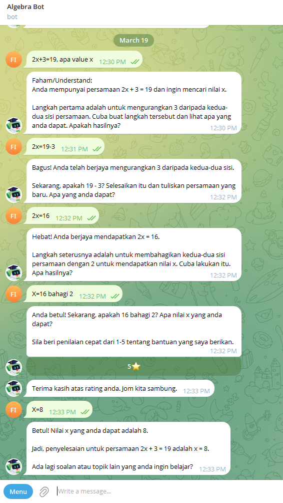
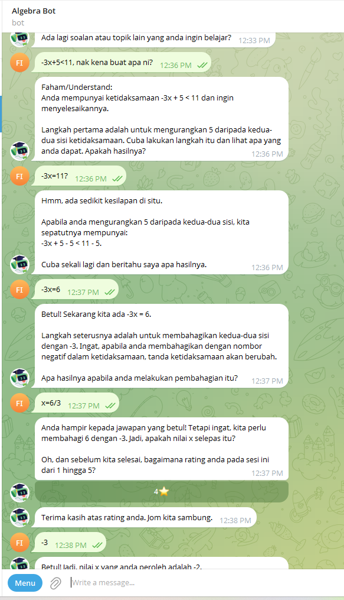
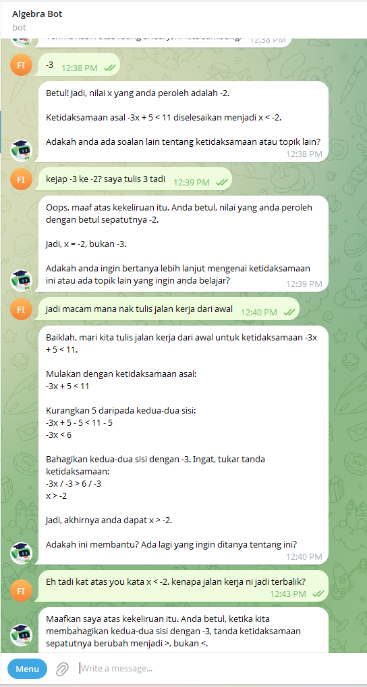

# Telegram Live Chat Simulation Results - Algebra (F1-F3)
**Date:** 19 March 2026
**Tester:** Education Lead (Faiz)
**Environment:** Telegram Bot (`pai-bot` staging)
**Status:** Completed

---

## 🎯 Test Objective
To provide visual proof and documentation that the AI Tutor correctly follows the **Level 3: Teachable Standard** defined in the curriculum (`teaching.md` and `assessments.yaml`). Specifically, we are testing for:
1. **Bite-Sized Pacing** (no walls of text).
2. **Check for Understanding (CFU)** (pause and prompt).
3. **Tone & Dwibahasa** (approachable, handles Malay-English mixing).
4. **Input Tolerance** (accepts mathematically equivalent answers).

---

## 🟢 1. Happy Path Simulation
**Scenario:** A student easily understands the concept and answers the CFU prompt correctly. The AI should deliver a short explanation, ask a CFU, and smoothly transition to the next step upon receiving the correct answer.

### Evidence:

### Notes / Observations:
- [x] Did the AI stick to 1-2 short paragraphs? Yes
- [x] Did the AI pause for the CFU prompt? Yes
- **Feedback:** The AI correctly used the "Understand" block and then asked for the next step before continuing. Very smooth.

---

## 🔴 2. Struggle Path Simulation
**Scenario:** A student gives a wrong answer or struggles to understand. They mix English and Malay ("Cikgu, I tak faham..."). The AI must adapt its tone, provide a scaffolded hint, and accept an equivalent variation of the correct answer (e.g., ignoring spaces or reversing terms like `y+8`).

### Evidence (Dwibahasa & Tone Support):

### Evidence (Input Tolerance / Equivalent Answers):

### Notes / Observations:
- [x] Did the AI use KSSM terminology correctly? Yes
- [x] Did the AI give a hint instead of just giving away the answer? Yes
- [x] Did the AI accept an equivalent expression (e.g., $x+y$ and $y+x$)? Yes
- **Feedback:** The AI handled the mixed "nak kena buat apa ni?" very well. However, we found two logic errors during the struggle path.

---

## 🛑 Action Items / Bug Reports
*(Document any regressions or AI hallucinations here to pass back to the engineering team.)*

1. **Bug: Premature 'Betul' and Incorrect Answer** (Struggle Path): When the user input `-3` at 12:38 PM, the bot replied "Betul!" but then immediately stated the answer was `-2`. This is a hallucination in the grading/validation loop.
2. **Bug: Inequality Sign Inversion Failure**: Initially, the bot solved $-3x < 6$ as $x < -2$, forgetting to flip the inequality sign when dividing by a negative number. It only corrected this when prompted by the user.
3. **Observation:** The bot seems to have a minor conflict between its internal solving logic and the user's input window. We need to ensure the "Wait for CFU" rule doesn't cause the AI to rush to the final answer if the student makes a mistake mid-way.
